# ProjectClass (Unreal Portfolio)

[](#)  
**전투/AI/보스 중심 언리얼 포트폴리오**입니다. 전투·AI·보스 패턴 중심의 실전형 언리얼 프로젝트입니다.  
데이터 드리븐 스킬 시스템, 대형 보스 HitPart 구조, AI/프로젝타일/IK 등  
언리얼 기반 핵심 Gameplay 시스템을 직접 설계·구현했습니다.

//> 🎬 **플레이 영상**:
//> 🖼️ **GIF**:
---
## 📘 목차
- [기본 기능](#기본-기능)
- [대형 보스 시스템](#대형-보스-시스템)
- [전투 & enemy-ai](#전투--enemy-ai)
- [상태이상·버프 시스템](#상태이상버프-시스템)
- [UI·옵션 시스템](#ui옵션-시스템)
- [오디오 시스템](#오디오-시스템)
- [디버그·툴링](#디버그툴링)
- [시연 GIF](#시연-gif)
           
---

## 기본 기능
- **데이터 드리븐 전투 시스템 (SkillTable / ExecTable 기반)**
  - 콜리전, 데미지, CC, 사운드, FX, 카메라 셰이크까지 모두 데이터로 관리
- **타겟 락온 기능**
- **암살**
- **콤보 / 구르기 / 가드**
- **스태미나 시스템** (소모 / 지연 / 재생)
- **히트 리액션**
  - 히트 애니메이션 적용
  - Overlay 머티리얼 적용
  - 데미지 플로터

 
## 대형 보스 시스템
- **대형 보스 충돌 커스텀 처리**
  - Boss Mesh의 큰 Bounding에 맞춘 Overlap/Trace 보정 
- **타겟과에 위치 기반 공격 선택**
   - EPC_ProximityType 방향 판정 : Front / Back / Left / Right / Near_L / Near_R / Far
- **부위별 타격 판정 HitPart 시스템**
  - PhysicsAsset 본(Bone) 기반 부위 판정**
  - `HitPartTable`을 통해 부위마다:
  - 부위별 데미지 배점 분리
- **피격부위 데칼 처리(Skinned Decal Component)**
  - 전용 FX / 데칼

    
## 전투 & Eenemy AI
- 타겟 거리에 맞는 루트모션 공격 애님 실행
- **AI Perception** : 시각(각도/거리), 청각, 피해 인지
- **BT,BB** (Decorator, Service)
- **패트롤 경로** Splie Component 활용
- **EQS** : 자연스러운 타겟과의 대치 포지션 및 이동
- **AI 상태**
  - Patrol, Investigating, Battle, CrowdControlled, SkillUsing,Dead


## 상태이상·버프 시스템
- `StatusEffectTable` 기반 데이터 구조
- 가산/곱연산 분리
- 버프형 / 디버프형 필터
- HUD 아이콘 동적 정렬 및 숨김 처리
 

## UI·옵션 시스템
- **UGameInstanceSubsystem 기반 UI 관리**
- DamageFloater / BossHPBar 등 공용 생성 포인트 제공
- 옵션 시스템:
  - DataAsset 기본값 + SaveGame 저장
  - Foliage / Shadow / AA / PostProcess 등 그래픽 옵션 ON/OFF
  - BGM / SFX 슬라이더
  - 카메라 감도

 
## 오디오 시스템
- AudioSubsystem 기반 **BGM/SFX 통합 관리**
- BGM 페이드 인/아웃
- AnimNotify 기반 공격/발자국 SFX
- PlaySFXAtLocation / Attached 형태로 분류


## 🛠️ 디버그·툴링
- **Exec 콜리전 시각화**  
  - 공격 판정이 의도한 범위와 타이밍에 정확히 동작하는지 즉시 검증하기 위한 기능
- **Enemy Detect Range / 시야각 디버그**  
  - AI가 플레이어를 언제 인식하는지 시각적으로 확인해 튜닝 효율을 높이기 위한 기능
- **Projectile 경로 디버그**  
  - 투사체 충돌 및 이동 경로가 데이터값에 따라 어떻게 반영되는지 확인하기 위한 기능
- **캐릭터 상태 디버그 텍스트(UWidgetComponent)**  
  - 캐릭터의 현재 상태, AI 상태 등을 게임 화면에서 직접 모니터링하기 위한 기능
- **간편화 및 개선 툴**
  - **루트모션 거리 자동 계산 → 테이블화**  
    - 전투 중 타깃 거리별로 정확한 RootMotion 공격을 선택하기 위해 이동 거리를 자동 계산·기록하는 툴
  - **PhysicsAsset → HitPart 자동 생성 및 테이블화**  
    - 본(Bone) 구조가 다른 보스·몬스터에도 HitPart 정보를 빠르게 적용하기 위해 자동으로 테이블화하는 툴


---

## 🎥 시연 GIF

| 기능                                      | 미리보기 |
|-------------------------------------------|----------|
| **락온 & 각도 기반 타깃팅**               | 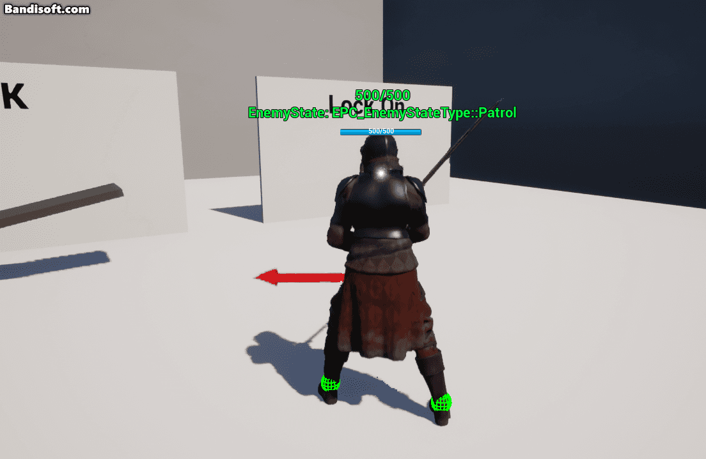 |
| **Control Rig 발바닥 IK**                 | 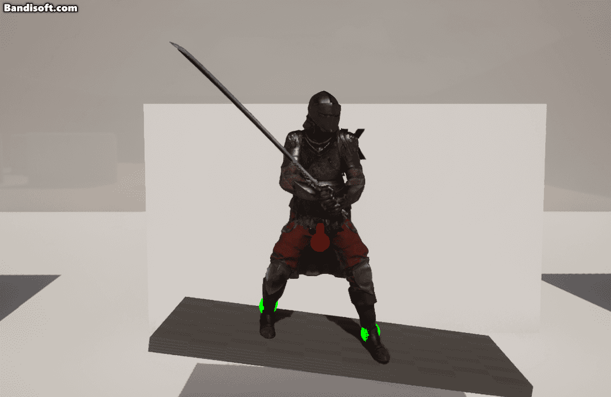 |
| **암살**                                  | 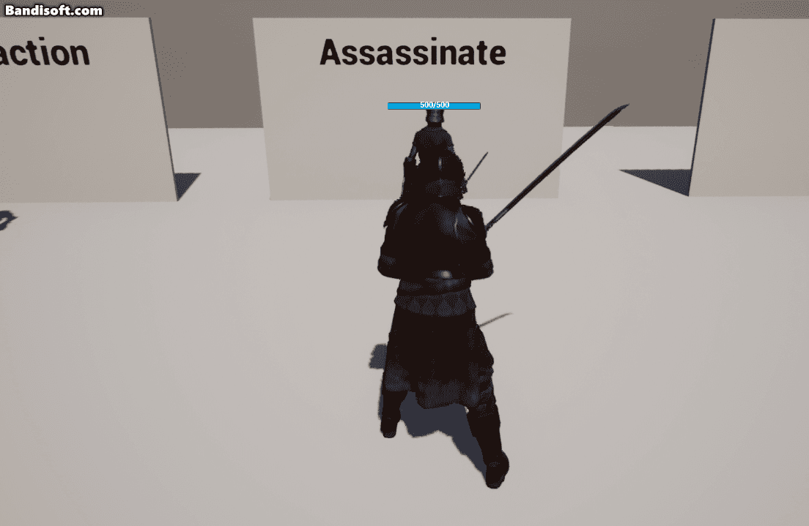 |
| **보스 패턴 – 원형 낙하 (Projectile )** | 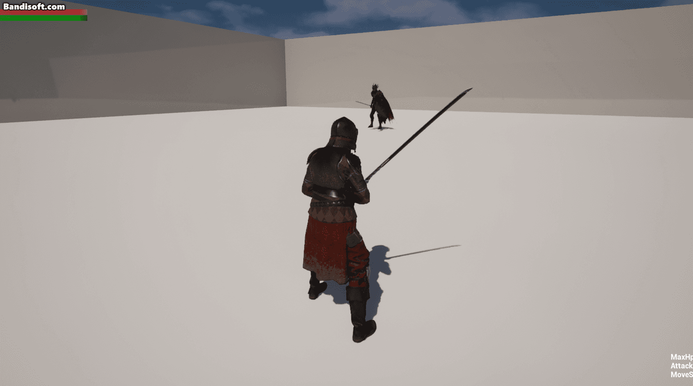 |
| **보스 – HitPart 부위별 피격 (데칼 포함)** | <div style="display:flex; gap:15px; justify-content:center; flex-wrap:wrap;">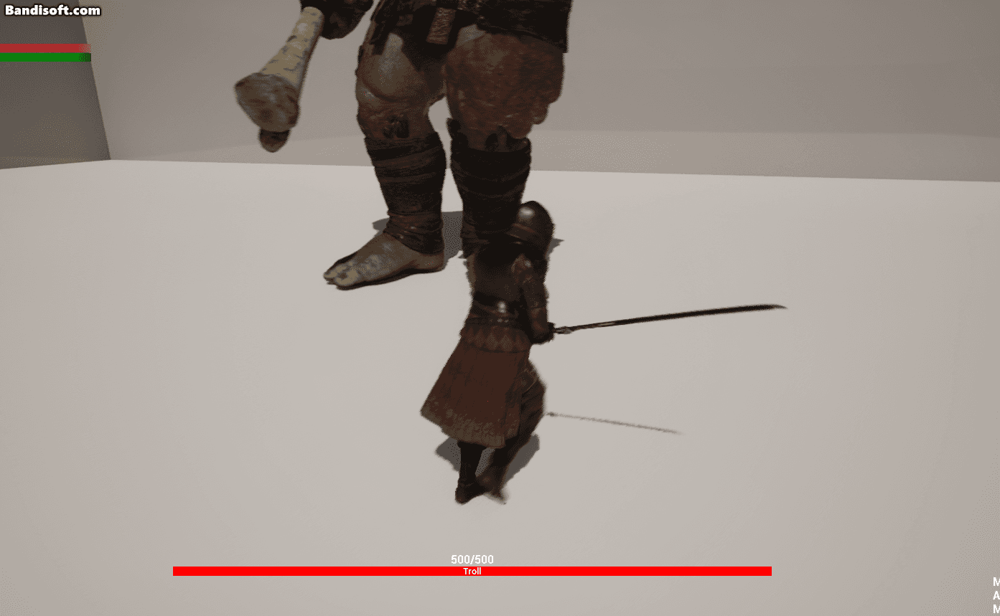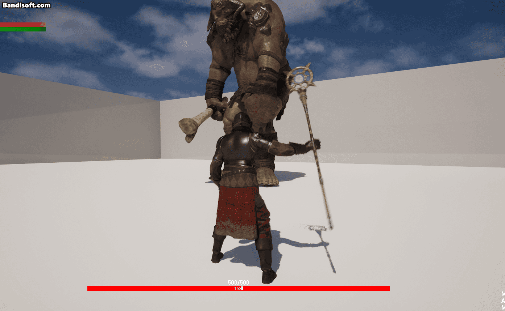</div> |
| **보스 – 방향 기반 공격 선택 (EPC_ProximityType)** | <div style="display:flex; gap:12px; justify-content:center; flex-wrap:wrap;">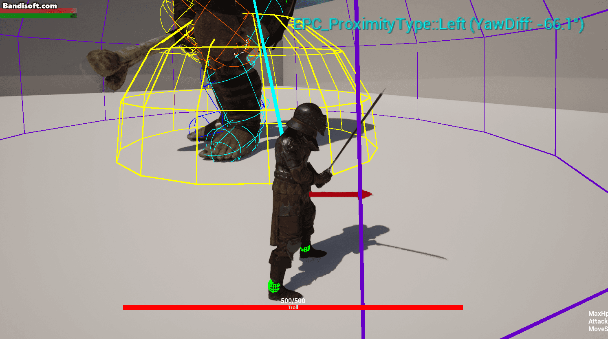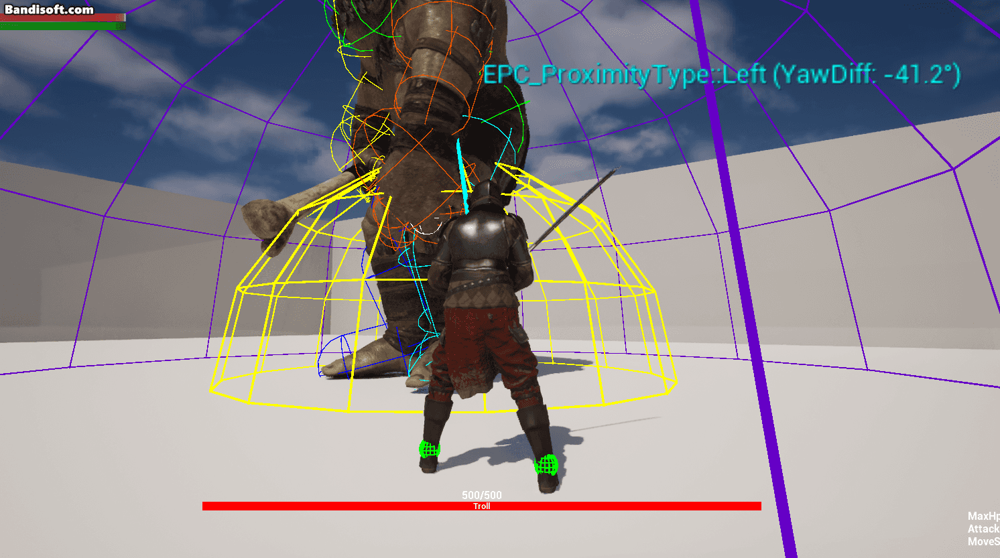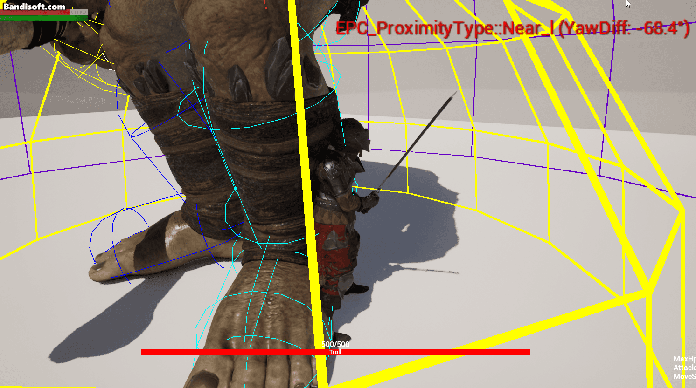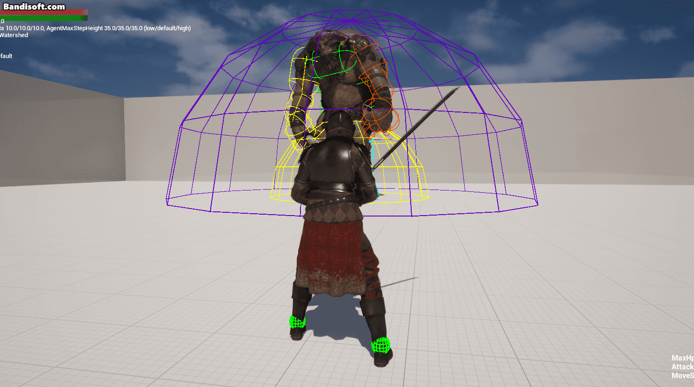</div> |
| **EQS – 자연스러운 대치/회피 포지션 탐색** | 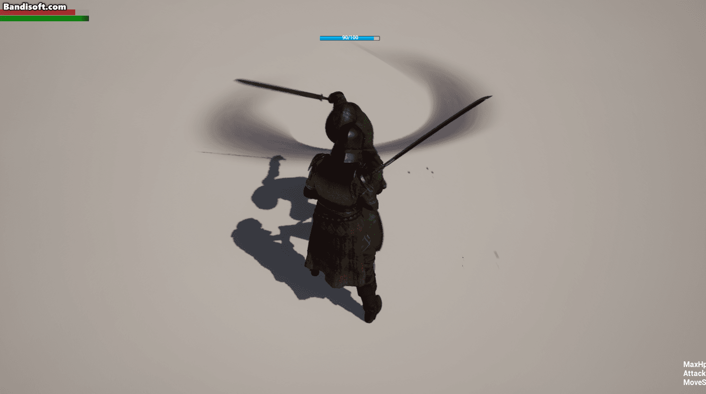 |
| **스킬 – 투사체 궤적 (Arc Preview)**      | 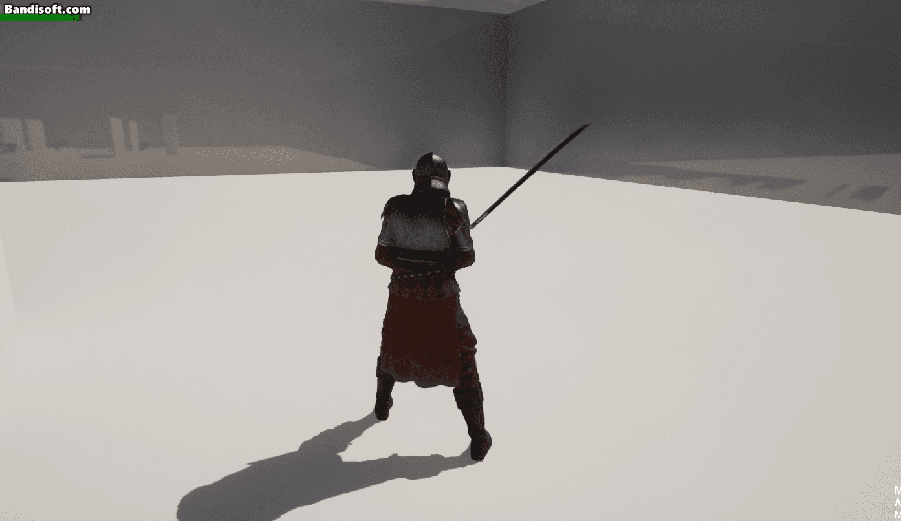 |
| **상태이상/버프 HUD 갱신**                 | 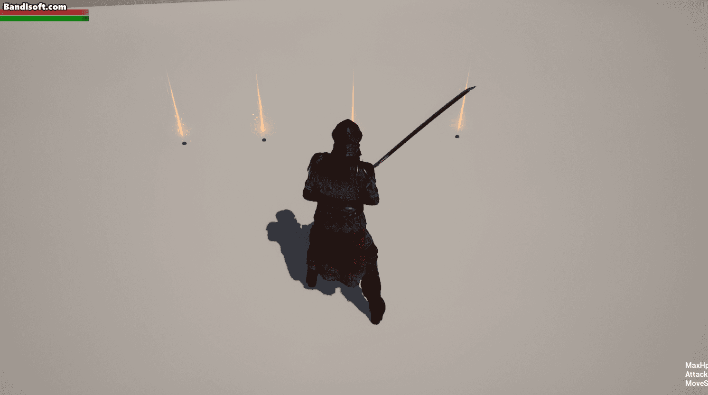 |
| **루트모션 기반 공격 (거리 맞춰 선택)**     | 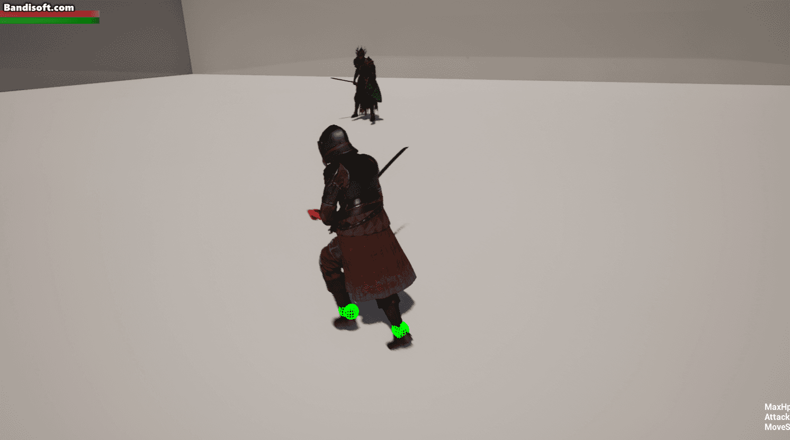 |

---

## 🧩 기술 스택
- **Engine**: Unreal Engine 5.5
- **Language**: C++20 / Blueprint
- **Animation**: Control Rig, Montage, Notify
- **AI**: Behavior Tree, AI Perception
- **FX**: Niagara / Camera Shake
- **UI**: UMG, UGameInstanceSubsystem
- **툴링**: Rider / Visual Studio / Git LFS

---
## 📂 소스 코드 구조

<details>
<summary>펼쳐보기 / 접기</summary>

```plaintext
## 📂 소스 코드 구조

<details>
<summary>펼쳐보기 / 접기</summary>

```plaintext
└─PC
    │  PC.Build.cs
    │  PC.cpp
    │  PC.h
    │  PC_Enum.h
    │  PC_BlueprintFunctionLibrary.cpp
    │  PC_BlueprintFunctionLibrary.h
    │
    ├─AI
    │  │  PC_AIController.cpp
    │  │  PC_AIController.h
    │  │  PC_BTDecorator_CheckRange.cpp
    │  │  PC_BTDecorator_CheckRange.h
    │  │  PC_BTTask_DashBack.cpp
    │  │  PC_BTTask_DashBack.h
    │  │
    │  └─Actor
    │          PC_PatrolRoute.cpp
    │          PC_PatrolRoute.h
    │
    ├─Animation
    │      PC_AttackTraceNotify.cpp
    │      PC_AttackTraceNotify.h
    │      PC_CamShakeNotify.cpp
    │      PC_CamShakeNotify.h
    │
    ├─Character
    │  │  PC_BaseCharacter.cpp
    │  │  PC_BaseCharacter.h
    │  │  PC_PlayableCharaceter.cpp
    │  │  PC_PlayableCharaceter.h
    │  │  PC_NonPlayableCharacter.cpp
    │  │  PC_NonPlayableCharacter.h
    │  │
    │  ├─Component
    │  │      PC_ActionComponent.cpp
    │  │      PC_ActionComponent.h
    │  │      PC_BattleComponent.cpp
    │  │      PC_BattleComponent.h
    │  │      PC_StatusEffectComponent.cpp
    │  │      PC_StatusEffectComponent.h
    │  │      PC_SkillComponent.cpp
    │  │      PC_SkillComponent.h
    │  │      PC_LockOnComponent.cpp
    │  │      PC_LockOnComponent.h
    │  │
    │  └─Controller
    │          PC_PlayerController.cpp
    │          PC_PlayerController.h
    │
    ├─Data
    │      PC_PlayerDataAsset.h
    │      PC_TableRows.h
    │
    ├─Interface
    │      PC_CharacterInterface.h
    │      PC_CharacterWidgetInterface.h
    │      PC_CharacterAIInterface.h
    │
    ├─Subsystem
    │      PC_DataSubsystem.cpp
    │      PC_DataSubsystem.h
    │      PC_UISubsystem.cpp
    │      PC_UISubsystem.h
    │      PC_OptionSubsystem.cpp
    │      PC_OptionSubsystem.h
    │      PC_AudioSubsystem.cpp
    │      PC_AudioSubsystem.h
    │
    ├─UI
    │      PC_DamageFloaterWidget.cpp
    │      PC_DamageFloaterWidget.h
    │      PC_StatusEffectWidget.cpp
    │      PC_StatusEffectWidget.h
    │      PC_OptionSettingWidget.cpp
    │      PC_OptionSettingWidget.h
    │
    └─Utills
           PC_GameUtill.cpp
           PC_GameUtill.h


